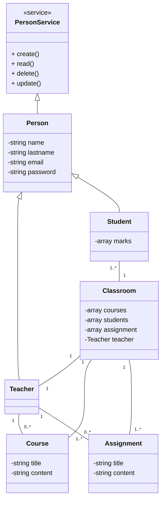

# D6 - JRI - TP POO
## Créer une application métier qui permet de gérer les cours ITAkademy:

- [x] Gérer les cours
    - [ ] Déposer un devoir
    - [ ] Déposer un cours
    - [ ] Rendre un devoir
    - [ ] Noter un devoir
    - [ ] Calculer la moyenne de l’élève
    - [ ] Calculer la moyenne de la classe
- [x] Gérer les étudiants
- [x] Gérer les enseignants
- [x] Se connecter / s’inscrire

### Critères dévaluation :
- [x] Surcharger une méthode
- [x] Override toString
- [x] Créer un héritage entre deux classes avec extends ou implements
- [x] Implémenter le pattern singleton
- [x] Utiliser l’encapsulation
- [x] Créer un helper (EtudiantHelper, qui permet d’afficher les cours de l’élève, et ses notes)

### Bonus

- [ ] Créer une API qui permet d’exporter toutes les notes (accès professeur)

### Aide
Un étudiant et un professeur :
- Ont des champs similaires (login, pwd, …) 🡪 Héritage à prévoir
- Ont accès à des services similaires et des services différents 🡪 Interface à prévoir

## Diagramme de classe



## Docker

```bash
# Création de l'image
docker build --pull --rm -f "TP_POO/Dockerfile" -t d6phppoo:latest "TP_POO"
```

```bash
# Lancer l'image
docker run --rm -d -p 9001:80/tcp -v src:/var/www/html d6phppoo:latest
```